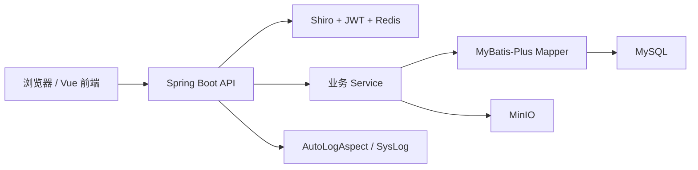
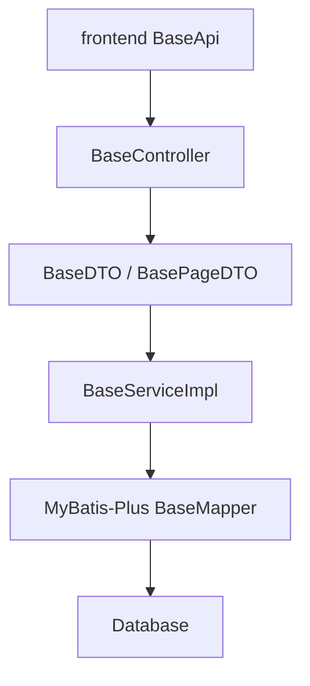

# 系统概要设计

## 总体架构

## 请求链路

1. 前端通过 `requestClient` 发起请求。
2. 后端过滤器解析 token，写入用户和租户上下文。
3. Controller 接收参数并调用 Service。
4. Service 执行业务校验、事务、Mapper 查询或写入。
5. 返回 `BaseResult<T>`。
6. 前端根据统一响应结构更新页面状态。

## 通用 CRUD 架构

标准资源 Controller 继承 `BaseController<S, E, V, R>` 后自动获得：

- `POST /list`
- `POST /page`
- `POST /getById`
- `POST /save`
- `POST /batchSave`
- `POST /delete`
- `POST /batchDelete`
- `POST /import`
- `POST /export`

## 横切能力

- 认证：JWT + Redis token。
- 权限：`@ModuleInfo`、`@RequiresPermission`、`PermissionAspect`。
- 租户：`TenantContextHolder`、`TenantContextFilter`、MyBatis-Plus tenant handler。
- 日志：`AutoLogAspect` 和 `sys_log`。
- 异常：`GlobalExceptionHandler`。
- 导入导出：`ExcelUtils` + EasyExcel。
