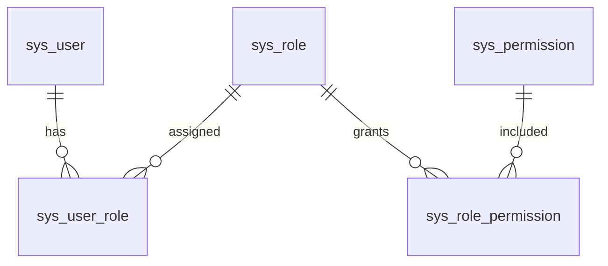
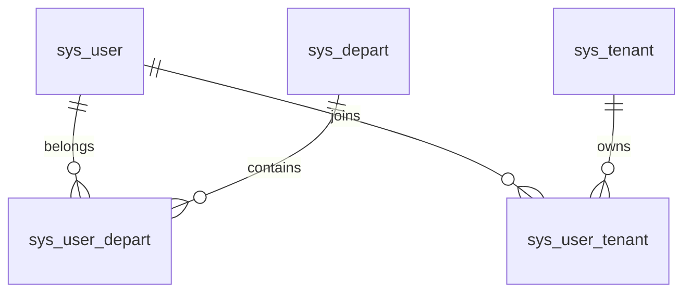
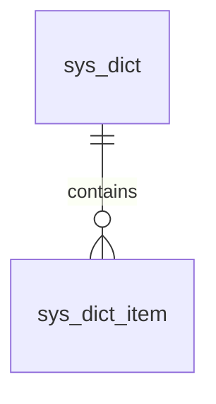

# 表关系说明

## 用户、角色、权限

```mermaid
erDiagram
  sys_user ||--o{ sys_user_role : has
  sys_role ||--o{ sys_user_role : assigned
  sys_role ||--o{ sys_role_permission : grants
  sys_permission ||--o{ sys_role_permission : included
```

## 用户、部门、租户

```mermaid
erDiagram
  sys_user ||--o{ sys_user_depart : belongs
  sys_depart ||--o{ sys_user_depart : contains
  sys_user ||--o{ sys_user_tenant : joins
  sys_tenant ||--o{ sys_user_tenant : owns
```

## 字典

```mermaid
erDiagram
  sys_dict ||--o{ sys_dict_item : contains
```

## 权限树

`sys_permission.parent_id` 指向同表 `id`，用于构建菜单和权限树。

## 部门树

`sys_depart.parent_id` 指向同表 `id`，用于构建组织机构树。
