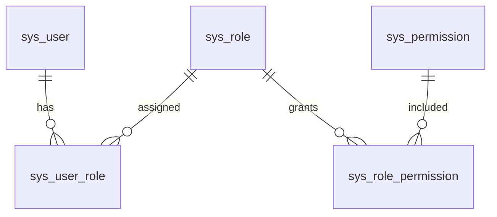
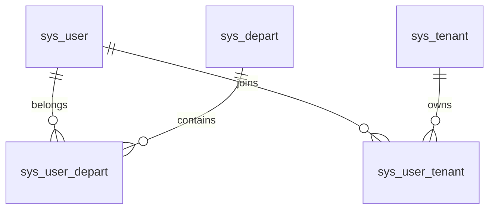
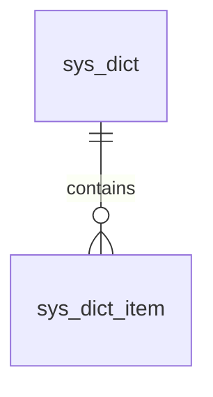
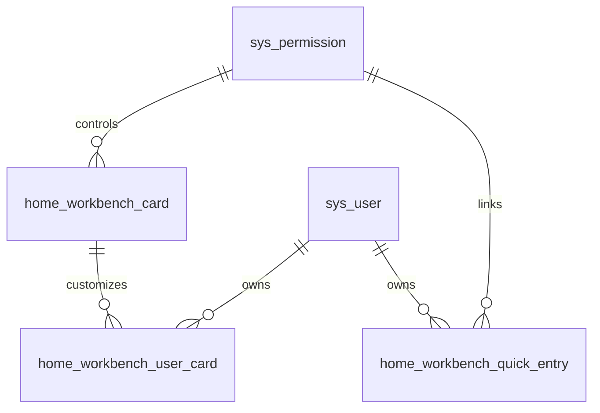
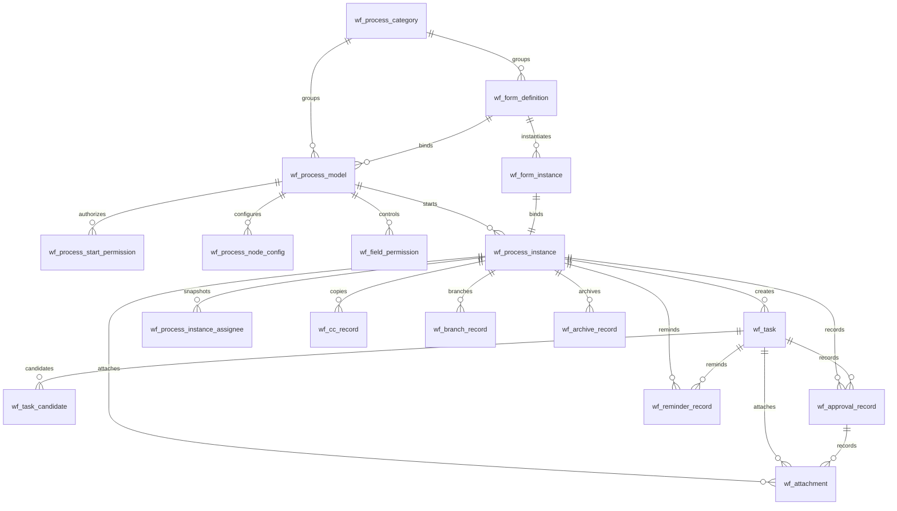

# 表关系说明

## 用户、角色、权限

## 用户、部门、租户

## 字典

## 权限树

`sys_permission.parent_id` 指向同表 `id`，用于构建菜单和权限树。

## 工作台

`home_workbench_card.permission_code` 对应 `sys_permission.perms` 中的按钮权限码，可为空；为空表示拥有工作台访问权的用户默认可见。

`home_workbench_user_card.card_code` 对应 `home_workbench_card.card_code`，用于保存用户个人布局偏好，不改变系统默认卡片配置。

`home_workbench_quick_entry.menu_id` 可指向 `sys_permission.id`，用于把快捷入口绑定到当前用户有权访问的菜单；用户个人快捷入口只能由本人维护。

## 部门树

`sys_depart.parent_id` 指向同表 `id`，用于构建组织机构树。

## 审批中心

`wf_field_permission.node_id` 与 `wf_process_node_config.node_id` 对应 BPMN `taskDefinitionKey`，用于控制某个节点下 FormCreate 字段的隐藏、只读和可编辑状态。

二期新增的 `wf_cc_record` 只授予审批详情查看权，不生成待办任务；`wf_reminder_record` 只记录催办和超时提醒，不改变流程状态；`wf_attachment` 记录审批附件语义，文件元数据仍在 `sys_files`，文件业务关系仍在 `sys_file_relation`；`wf_branch_record` 保存条件分支命中路径，用于流程图高亮和审计排查。

三期新增的 `wf_archive_record` 保存流程归档快照，用于归档列表、详情入口和材料包下载校验；归档不改变流程实例状态，也不隐藏运行时历史记录。
